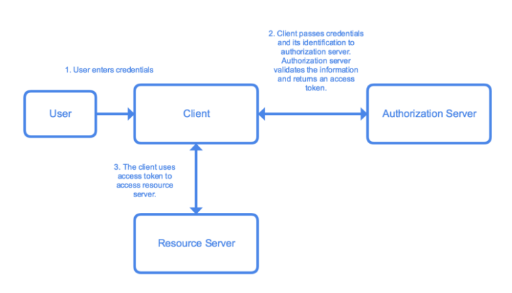
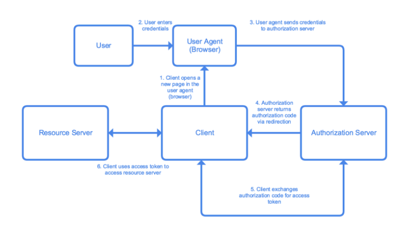
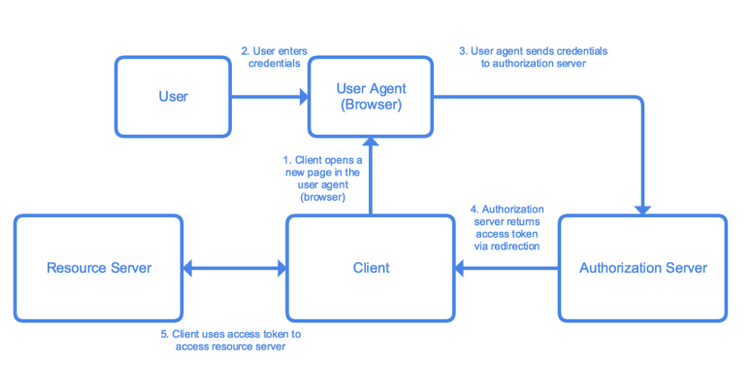
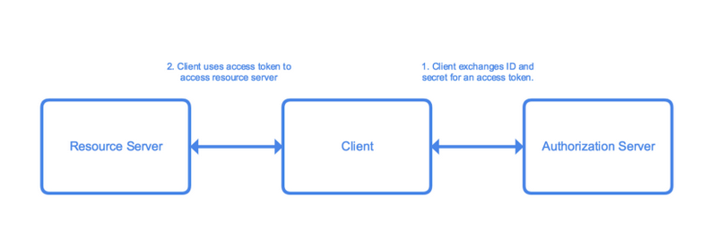

# SAML, JWT, OAuth 2.0 and OpenID
<!-- TOC tocDepth:2..3 chapterDepth:2..6 -->

- [1. JWT Token](#1-jwt-token)
- [2. SAML](#2-saml)
- [3. OAuth 2.0](#3-oauth-20)
  - [3.1. Terminology](#31-terminology)
  - [3.2. Grant Types](#32-grant-types)
  - [3.3. Resource Owner Password Credentials](#33-resource-owner-password-credentials)
  - [3.4. Authorization Code Flow](#34-authorization-code-flow)
  - [3.5. Authorization Code Flow With PKCE](#35-authorization-code-flow-with-pkce)
  - [3.6. Implicit Flow](#36-implicit-flow)
  - [3.7. Client Credentials Flow](#37-client-credentials-flow)
- [4. Sources](#4-sources)

<!-- /TOC -->

## 1. JWT Token

- A bearer token that contains a header, payload and signature
- The header contains the type of token such as JWT and the signing algorithm such as HMAC SHA256 or RSA
- The payload contains information, for OAuth this contains the claims or scopes; information and what they are allowed to do
-

The following link allows decoding of JWT

- <https://jwt.io/>

## 2. SAML

SAML or Security Assertion Markup Language is am open standard for exchanging authentication and authorization data. Though an old technology SAML is still used extensively in Enterprise for single sign on between many sites and a companies identity provider such as Active Directory.

## 3. OAuth 2.0

The OAuth 2.0 authorization framework is a protocol which permits a user, known as a **Resource Owner** to grant a third-party entity such as a website, known as a **Client**, to access there **Resource Owner's** protected resources without exposing the third-party their user credentials or identity.  The resources could be another API or it could actually be on the same web server as the **Client**.

The **Client** is provided a token, normally JWT, which permits access to the **Resource Owner's** protected resources. The token defines the lifetime, scope and other access attributes that define the **Client's** permitted access. The permissions that the token permits are known as **scopes**.

### 3.1. Terminology

| OAuth                    | Example                                                      | Description                                                  |
| ------------------------ | ------------------------------------------------------------ | ------------------------------------------------------------ |
| **Resource Owner**       | Your end user                                                | Entity that can grant access resource. Typically this is the end user |
| **Client**               | Your web server                                              | Application requesting access to a protected resource on behalf of the **Resource Owner** |
| **Authorization Server** | Google, Microsoft, Facebook                                  | Server that authenticates the **Resource Owner** and issues Access Tokens after getting proper authorization |
| **Resource Server**      | You API/Web Server requiring                                 | Server hosting the protected resources. This is the API you want to access |
| **User Agent**           | The client's web browser or mobile phone application         | Agent used by the **Resource Owner** to interact with the **Client** (for example, a browser or a native application) |
| **Authorization Code**   | A token which can be exchanged for an **Access Token**       |                                                              |
| **Access Token**         | A bearer token used between all parties instead of the users credentials |                                                              |
| **JWT Token**            | A defined industry format bearer token. Often used as the **Access Token** in **OAuth** | JSON Web Token Structure is a token which is signed. It contains an a header, payload and signature. Scopes are included inside which permits the permitted actions on behalf of the user |
| **Refresh Token**        |                                                              |                                                              |
| **Scope**                | A permitted action                                           | JWT Token contains scopes which are actions that the bearer of the token is allowed to perform |

### 3.2. Grant Types

There are a number of grant types or flows each with specific use cases.

| Grant Type                                                   | Used By                                                      |
| ------------------------------------------------------------ | ------------------------------------------------------------ |
| **Authorization Code Flow**                                  | Server-side application that is capable of securely storing secrets |
| **Authorization Code Flow with Proof Key for Code Exchange (PKCE) technique** | Mobile applications                                          |
| **Implicit Flow with Form Post**                             | Single Page Applications (SPAs) executing on the user's browser |
| **Resource Owner Password Flow**                             | Highly-trusted applications                                  |
| **Client Credentials Flow**                                  | Machine to machine communication                             |

### 3.3. Resource Owner Password Credentials

- The client must be highlight trusted as it handles user credentials directly

1. The **Client** prompts the **User** to enter their user credentials
2. The **Client** sends the credentials and it's own identification (**Client Secret** and **Client Id**), to the **Authorization Server**
3. The **Authorization Server** returns to the **Client** an **Access Token**
4. The **Client** uses the **Access Token** to access the **Resource Owner's** resources on the **Resource Server** which in turn validates the **Access Token**

### 3.4. Authorization Code Flow

2. 1. The **Client** directs **User Agent** to the **Authorization Server**, where the **User** authenticates themselves
2. The **User Agent** receives an **Authorization Code** from the **Authorization Server**
3. The **Authorization Code** is passed to the **Client** from the **User Agent**
4. The **Client** sends the **Authorization Code** its own identification (**Client ID** and **Client Secret**)the  **Authorization Server** and the **Authorization Server** returns an **Access Token**, probably in the form of a **JWT Token** and potentially a **Refresh Token**
5. The **Client** uses the **Access Token** to access the **Resource Owner's** resources on the **Resource Server** which in turn validates the **Access Token**

### 3.5. Authorization Code Flow With PKCE

- Very similar to the **Authorization Code Flow** but it used where there is no server-side code, for example on mobile phones. Rather than expose the **Client ID** and **Client Secret** to the **User Agent**, they are sent a **Code Challenge**. The **Authorization Server** calls the **Client** with the **Code Challenge** which is verified against the **Code Verifier** and this performs the Client identification on the

### 3.6. Implicit Flow

- Designed for SPAs. It is similar to **Authorization Code** flow except for the part involving the **Authorization Code**. The **Client** is not sent an **Authorization Token**, instead the **Authorization Server** sends the **User Agent** the required **Access Token** directly. **Refresh Tokens** are not allowed in this flow.

### 3.7. Client Credentials Flow

- This flow is closer to **Resource Owner Password Credentials flow**. A **Client**  identify themselves (**Client ID** and **Client Secret**) with the **Authorization Server**  and receive **Access Tokens** with the authorization server. You should not use **Refresh Tokens**.

  

## 4. Sources

- <https://developer.okta.com/docs/guides>
- <https://auth0.com/docs/protocols/protocol-oauth2>
- <https://developer.okta.com/blog/2017/06/21/what-the-heck-is-oauth>
- <https://medium.com/google-cloud/understanding-oauth2-and-building-a-basic-authorization-server-of-your-own-a-beginners-guide-cf7451a16f66>
